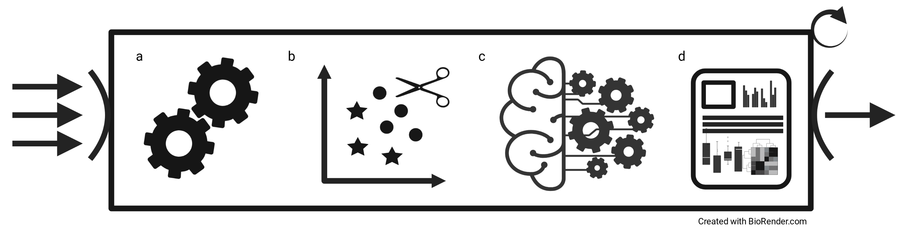

# Unsupervised encoding selection and ensemble performance for biomedical classification



Overview image illustrating the performance analyses of classifier ensembles on peptide encodings. An arbitrary number of encoded datasets can be processed (arrows). The workflow conducts preprocessing (a), ensemble pruning (b), training/testing (c), and processing of results (d) using a 100-fold Monte Carlo cross-validation. Manuscript submitted for publication.

### Execution

To run all experiments, execute ```snakemake --cores 32 --quiet```.

In order to execute the ensemble pruning using the Decision Tree classifier, stacking as the meta-model, with 5 folds, run ```snakemake data/temp/avp_amppred/ensemble_pfront/stacking/dt/{0,1,2,3,4}.csv --cores 32 --quiet```

This example will run the pruning for the `avp_amppred` dataset.